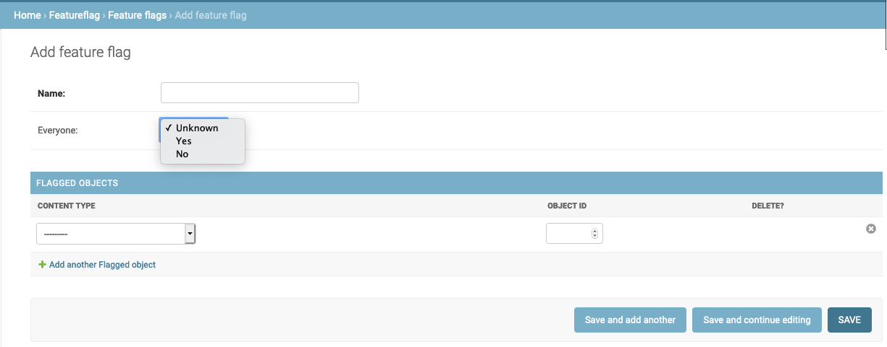

# Feature Flag

Very commonly, when implementing a new feature, we want to do a gradual rollout to clients or enable/disable it when convenient.
To achieve this we normally use an environment variable, which normally involves creating a pull request, merging it, then doing a deploy.
The problem with this approach is that it is very time consuming. 

Add feature flag on/off switches for everyone or for especific objects.

## Documentation

- [Installation](#installation)
- [Settings](#settings)
- [Usage](#usage)
- [Django Admin](#django-admin)

### Installation
```shell
$ pip install django-featureflag
```

### Settings
Add `featureflag` to the `INSTALLED_APPS` settings.
```python
INSTALLED_APPS = (
    # ...
    "featureflag",
    # ...
)
```

Global config variables are namespaced inside a single Django setting, named `FEATURE_FLAG`

```python
FEATURE_FLAG = {
    "CREATE_MISSING": True,
    "CREATE_DEFAULT": None,
}
```

`CREATE_MISSING`: (default: `True`) 
> Automatically create new flag if it is not found on the database.     

`CREATE_DEFAULT`: (default: `None`)
> Default value for the `everyone` field when automatically creating a new flag.  

### Usage
```python
import featureflag

myobj = MyModel.objects.first()

featureflag.is_active("flag_name")  # check if a flag is active for everyone
featureflag.is_active("flag_name", myobj)  # check if a flag is active for a specific object 
```
### Django Admin
Add/Remove related objects using Django Admin.


- Everyone:
    - Unknown: flag will be **active** only for related objects
    - Yes: flag will be **active** for everyone, regardless if in related objects
    - No: flag will be **disabled** for everyone, regardless if in related objects
